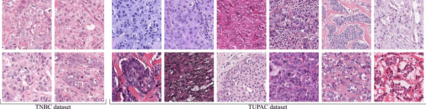
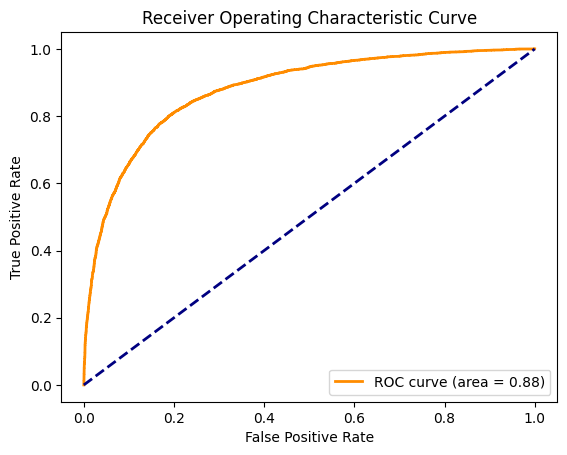

This project implements CNN using high-end python libraries such as `TensorFlow` and `Keras` to classify images to help detect Breast Cancer
# **Image Classification For Breast Cancer Detection**

# **Breast Cancer and H&E Staining**

## **Breast Cancer**

Breast cancer is the type of cancer that begins in the cells of the breast. It can occur in both men and women, but it is far more common and the second most common (after skin cancer) in women. These cancers are characterized by abnormal growth of certain breast cells that divide more rapidly than healthy cells causing a lump or mass. These cells can spread to the lymph nodes and other parts of the body [(Mayo Clinic)](https://www.mayoclinic.org/diseases-conditions/breast-cancer/symptoms-causes/syc-20352470#:~:text=Doctors%20know%20that%20breast%20cancer,other%20parts%20of%20your%20body.).

Breast cancer can be detected through various methods, including medical imaging like mammography, ultrasound, and magnetic resonance imaging (MRI), as well as through histopathologic examination of tissue samples. Usually, medical imaging techniques are done manually by experts. This poses a few challenges such as lack of experts, chances for False predictions, and human errors [(Zhu et al., 2023)](https://www.ncbi.nlm.nih.gov/pmc/articles/PMC7614504/).

Convolutional Neural Network (CNN) designs are widely used as stand-alone or in combination with other models for medical image analysis with higher accuracy outcomes. This project focuses on testing two models for the image analysis of breast cancer detection. [(Zhu et al., 2023)](https://www.ncbi.nlm.nih.gov/pmc/articles/PMC7614504/).

## **H&E Staining**

Hematoxylin and eosin (H & E) staining is a widely used technique in histology to visualize the microscopic structure of tissues. The technique helps in identifying different tissues types in a sample. Hematoxylin stains cell nuclei deep blue-purple reacting with nucleic acids, while eosin stains cytoplasm and extracellular matrix pink reacting with proteins. H&E staining is commonly used in pathology to examine tissue samples and identify abnormalities, including cancerous cells [(Fischer et al., 2008)](https://pubmed.ncbi.nlm.nih.gov/21356829/).

> Fig.: H & E staining of normal and breast cancer tissues. Histopathological observation of normal and tumor sections represents the mammary tissues from various experimental rat groups. The arrow shows a breast normal duct. (A), LA7-induced breast tumor (B), FLAHE low-dose treatment (C), FLAHE high-dose treatment (D), and tamoxifen-treated group (E). Histological examination of normal breast and tumor breast cancer before and after FALHE treatment. The normal breast shows normal duct tissues, but the LA7-induced breast tumor shows a disruption in morphology and an invasion of ductal cells throughout the breast tissues. Magnification, 40×. [(Tellez et al., 2018)](https://www.researchgate.net/publication/324073594_Whole-Slide_Mitosis_Detection_in_HE_Breast_Histology_Using_PHH3_as_a_Reference_to_Train_Distilled_Stain-Invariant_Convolutional_Networks#pf2)

## **Data Source**

[Train Data](train_labels.csv)

[Test Data](test_label.csv)

| Data | Size |
|------|------|
|Train|220026|
|Test|57458|

## **Optimizers**

1) Adam Optimizer
2) SGD Optimizer

**Tuned Parameters: Learning Rate, Step Size, Gamma**

## **Receiver Operating Characteristic**

The best ROC curve after tuning the parameters

## **Outcome**

|Label/Probability|Count|
|-----------------|-----|
|0.9    |     1|
|0.8   |   19098|
|0.7   |   10772|
|0.6   |  6599  |
|0.5   |   5453|
|0.4   |   4956|
|0.3  |  4226|
|0.2  |  3707|
|0.1 |   2508|
|0.0  |  138 |

***References***

`Zhu Z, Wang SH, Zhang YD. A Survey of Convolutional Neural Network in Breast Cancer. Comput Model Eng Sci. 2023 Mar 9;136(3):2127-2172. doi: 10.32604/cmes.2023.025484. PMID: 37152661; PMCID: PMC7614504.`

`Fischer AH, Jacobson KA, Rose J, Zeller R. Hematoxylin and eosin staining of tissue and cell sections. CSH Protoc. 2008 May 1;2008:pdb.prot4986. doi: 10.1101/pdb.prot4986. PMID: 21356829.`

Image source: `Tellez, David & Balkenhol, Maschenka & Otte-Höller, Irene & Loo, Rob & Vogels, Rob & Bult, Peter & Wauters, Carla & Vreuls, Willem & Mol, Suzanne & Karssemeijer, Nico & Litjens, Geert & van der Laak, Jeroen & Ciompi, Francesco. (2018). Whole-Slide Mitosis Detection in H&E Breast Histology Using PHH3 as a Reference to Train Distilled Stain-Invariant Convolutional Networks. IEEE Transactions on Medical Imaging. PP. 1-1. 10.1109/TMI.2018.2820199. `
